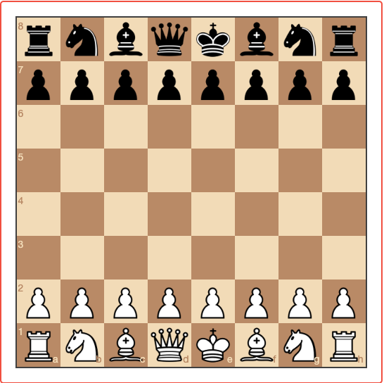
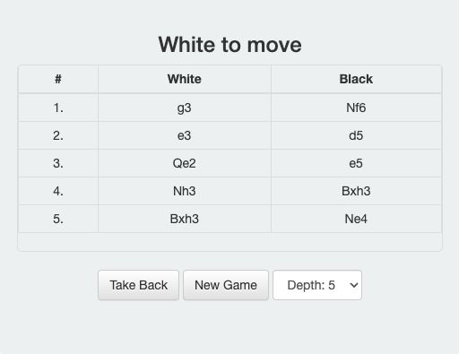
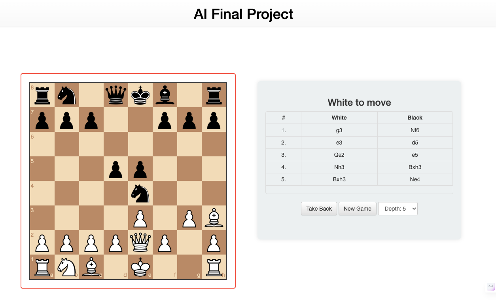

# Chess Bot Project

Welcome to the Chess Bot project! This is an AI-based chess bot implemented using the Flask framework. This project was developed as part of an AI course.

## Table of Contents
- [Installation](#installation)
- [Usage](#usage)
- [Screenshots](#screenshots)
- [Video Demo](#videodemo)
- [Contributing](#contributing)
- [License](#license)

## Installation

To get started with the Chess Bot project, follow these steps:

1. Clone the repository:

    ```bash
    git clone https://github.com/Alibakhshov/Chess.git
    ```

2. Navigate to the project directory:

    ```bash
    cd Chess
    ```

3. Install dependencies:

    ```bash
    pip install -r requirements.txt
    ```

4. Run the Flask application:

    ```bash
    python main.py
    ```

5. Open your browser and go to [http://localhost:5000](http://localhost:5000) to access the Chess Bot.

## Usage

Once the application is running, you can play chess against the bot. The interface is user-friendly, and you can make moves by clicking on the pieces and dragging them to the desired positions.

## Screenshots









## Video Demo


## Contributing

If you would like to contribute to the Chess Bot project, please follow these guidelines:

1. Fork the repository.
2. Create a new branch for your feature or bug fix.
3. Make your changes and commit them.
4. Push your changes to your fork.
5. Submit a pull request.

## License

This project is licensed under the [MIT License](LICENSE).

